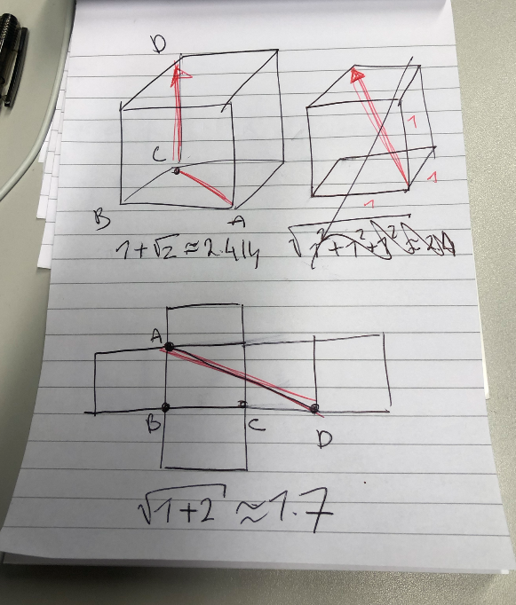

# Puzzle #3: The Fly in a Cubic Room 

From [here](http://puzzles.nigelcoldwell.co.uk/)

## Problem

>You are a bug sitting in one corner of a cubic room. You wish to walk (no flying) to the extreme opposite corner (the one farthest from you). Describe the shortest path that you can walk.

## Clue

There are two obvious short roots. For me the one I first thought of was not
the best one. Use Pythagoras theorem to work out the distances. The answer is
not 2.414

If you're struggling to visualise the route I can show you a diagram, leaving
you to work out the distance....

## Solution

OK, I know this one already but only because it sticks with you. The trick here is to "open up" the box. 

## Concepts

What problem solving concepts are used here? 

**Draw the problem**

Draw the problem. 

**Simple math**

Only Pythagoras is used here. Shortest distance between two points. 

**Manipulate shapes**

Don't be afraid to manipulate the geometric shapes in front of you. Pry open,
close, flatten, elongate, etc.

## Other problems

* [Problem #3](2020-01-27_riddle-03-bug.md)
* [Problem #5](2020-01-27_riddle-05-clock.md)
* [Problem #52](2020-01-27_riddle-52-socks.md)
* [Problem #68](2020-01-27_riddle-68-red-blue.md)