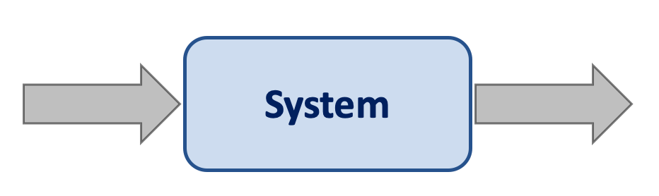
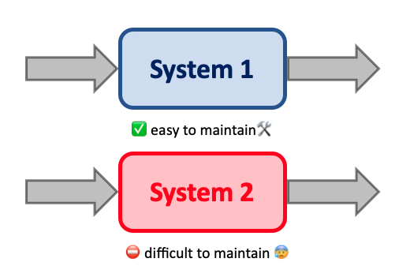

# Writing maintainable software

## Consider two systems

Consider a system 

Now consider two systems with exactly the same inputs and outputs

System 1 is fast, easy to modify, and a pleasure to work on. System 2 is
slow, hard to use, and its source code is difficult to change. Even though
both systems have exactly the same functionality, their *quality* is clearly
different.  

## The definition of maintainability

We define maintainability as **the ease with which a system can be modified**. 

## Types of bugs

There are four types of maintenance: 

* **Corrective maintenance.** The system needs to be changed to fix bugs that are found. 
* **Adaptive maintenance.** The system needs to be updated to reflect changes in the environment it works in, say changes in the OS or hardware. 
* **Perfective maintenance.** The system needs to be changed to reflect the changing requirements of the users or stakeholders. 
* **Preventive maintenance.** The system is preventively changed to increase the quality or prevent future bugs from occuring.

## Why does maintainability matter?

Maintainability matters for two key reasons: 

1. Maintainability has significant business impact
2. Maintainabiligty is an enabler for other quality characteristics. 

## Three key principles to follow

1. Maintainability benefits from simple guidelines.
2. Maintainability is not an afterthought. Every contribution counts. 
3. Some violations are worse than others. 

## Overview of ten maintainability guidlines

1. Write short units of code
2. Write simple units of code
3. Write code once
4. Keep unit interfaces small
5. Separate concerns in modules
6. Couple architecture components loosely
7. Keep architecture components balanced
8. Keep your codebase small
9. Automate development pipelines and tests
10. Write clean code

## Guideline 1: Write short units of code. 

Units are the smallest groups of code that can be maintained and executed
independently.

Units are methods and functions.

A unit is always executed as a whole. Therefore, the smallestt piece of code
that can be used, reused, and tested *is a unit*.

How to use this guideline? When writing a new unit (function), never let it
grow beyond 15 lines of code. When it does grow beyond 15 lines of code, does
it *really* belong where you're trying to put it?

## Guideline 2: Write simple units of code

Complexity is a tough subject. Just like beauty, complexity is in the eye of
the beholder. Code that might appear complex to a newcomer might appear
straightforward to a developer intimately familiar with it.

A good reason to measure complexity is to know the minimum amount of tests we
need to be sufficiently certain that the system acts the way we want it to.

However, before we can do any of these things we must measure complexity. 

A common way to assess the complexity of code is to count t he number of
possible paths through a piece of code. We can count this by the number of
branch points.

To measure complexity we take the McCabe complexity: **the number of branch  points +1**. 

We must understand that code starts out straightforward and tends to grow
much more complex over time. This is the reason why we are sometimes greeted
with convoluted code.

Why should we write simple units of code? 

* A simple unit is easier to understand and modify than a complex one. 
* Simple units are easier to test than complex ones. 

So how do we write simple units of code? By limiting the number of brand points. Sure. Then what things constitute as branch points? The following operators

* if/else statements
* cases
* ? (ternary operators) 
* && and || 
* while
* for
* catch

How to deal with conditional chains? 

1. Introduce a new data structure that maps options
2. Replace conditional with polymorphism (create new objects/interfaces)

How to deal with nesting? 

1. Replace nested conditional with guard clauses 
2. Extract separate conditionals to separate methods (binary tree example)

## Summary

* Limit units of code to 15 LOC
* Limit number of branch points to 4