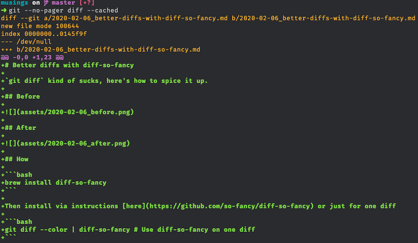
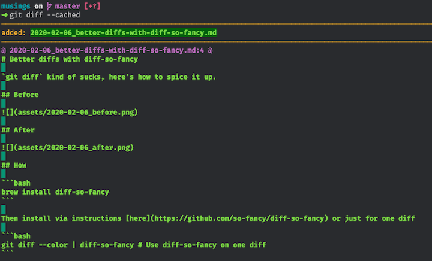

# Better diffs with diff-so-fancy

`git diff` kind of sucks, here's how to spice it up.

## Before 



## After



## How

```bash
brew install diff-so-fancy
```

Then install via instructions [here](https://github.com/so-fancy/diff-so-fancy) or just for one diff

```bash
git diff --color | diff-so-fancy # Use diff-so-fancy on one diff
```
