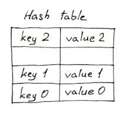
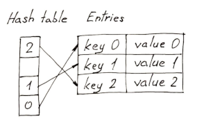

# Lists vs dicts

From [Python Dicts are now orered](https://softwaremaniacs.org/blog/2020/02/05/dicts-ordered/en/)

>Changed in version 3.7: Dictionary order is guaranteed to be insertion
order. This behavior was an implementation detail of CPython from 3.6.

## Fundamental high-level difference between dicts and lists

The *fundamental* difference between dicts and lists is that:

* Dict values are accessible by keys (can be of any immutable type)
* List values are accessible by integers

## Before 



* Hash tables holds keys/values in pseudorandom order based on hash value.
* Sparse array with unoccupied holes in a pre-allocated array.

## After



* Keys and values stored in separate dense array
* Hash table only holds references to these keys
* Why? Initial reason was to save space by sharing the hash tables of the same dicts with the same keys. 


## Dicts are significantly larger than lists

```python
In [79]: getsizeof(['' for i in range(100000)])
Out[79]: 824472

In [80]: getsizeof({i: '' for i in range(100000)})
Out[80]: 5242984
```

Dicts are more than a magnitude of order bigger than lists. This probably has to do with the hashing.

## Yet no difference insertion speed

>Surprisingly, I couldn't find any consistent difference in speed in neither
insertion of new values in a list and a dict[int], nor in traversing them. My
gut feeling tells me it's mostly due to the fact that a hash value of an int
is the int itself, so there's no time wasted on hashing.

Ivan (the author) finds no difference in the speed of inserting new values in a list
and int. He hypothesizes that this is because the hash value of an int is the
int itself.

## Sets are still unordered

```python
In [3]: list({'one': True, 'two': True, 'three': True, 'four': True, 'five': True})
Out[3]: ['one', 'two', 'three', 'four', 'five']

In [4]: list({'one', 'two', 'three', 'four', 'five'})
Out[4]: ['three', 'five', 'four', 'one', 'two']
```

Sets look a lot like dicts, but they have their own separate implementation.
