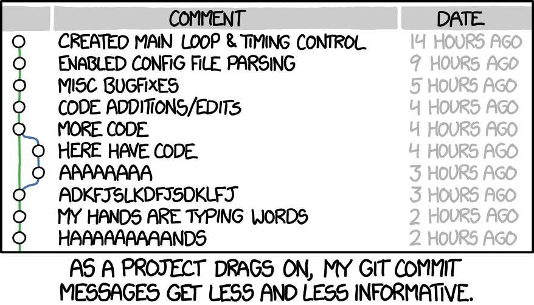

# How to write good commit messages

**tl;dr Use the imperative mood (fix, add, change, polish, etc.) and no period.**

From [here](https://github.com/erlang/otp/wiki/writing-good-commit-messages), and [here](https://chris.beams.io/posts/git-commit/).

Relevant XKCD



Would you rather read this: 

```bash
$ git log --oneline -5 --author cbeams --before "Fri Mar 26 2009"

e5f4b49 Re-adding ConfigurationPostProcessorTests after its brief removal in r814. @Ignore-ing the testCglibClassesAreLoadedJustInTimeForEnhancement() method as it turns out this was one of the culprits in the recent build breakage. The classloader hacking causes subtle downstream effects, breaking unrelated tests. The test method is still useful, but should only be run on a manual basis to ensure CGLIB is not prematurely classloaded, and should not be run as part of the automated build.
2db0f12 fixed two build-breaking issues: + reverted ClassMetadataReadingVisitor to revision 794 + eliminated ConfigurationPostProcessorTests until further investigation determines why it causes downstream tests to fail (such as the seemingly unrelated ClassPathXmlApplicationContextTests)
147709f Tweaks to package-info.java files
22b25e0 Consolidated Util and MutableAnnotationUtils classes into existing AsmUtils
7f96f57 polishing
```

Or this:

```bash
$ git log --oneline -5 --author pwebb --before "Sat Aug 30 2014"

5ba3db6 Fix failing CompositePropertySourceTests
84564a0 Rework @PropertySource early parsing logic
e142fd1 Add tests for ImportSelector meta-data
887815f Update docbook dependency and generate epub
ac8326d Polish mockito usage
```

Credits for these commit messages to go [this guy](https://chris.beams.io/posts/git-commit/). 

## ✅ Do

* Write in the imperative mood. Imagine that you are bossing or commanding
someone. Always start the commit message with an imperative verb like: "Fix",
"Add", "Do", "Polish", "Rework", "Change", etc.

## ⛔️ Don't

* No periods. A commit message is a title, not a sentence. Titles don't end with periods. 
