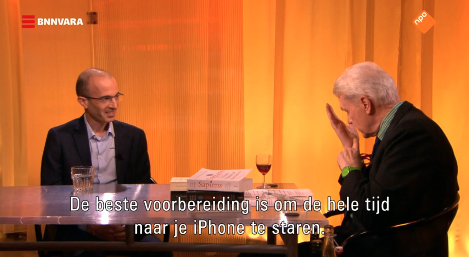

# Yuval Noah Harari and the power of storytelling

From [here](https://www.nrc.nl/nieuws/2020/02/05/locomotief-harari-overweldigt-van-dis-en-zijn-kijkers-a3989316)

De Wereld Draait Door (DWDD) (translated: The World Keeps Turning) is a Dutch
talkshow. It recently hosted an hour long interview with author [Yuval Noah
Harari](https://en.wikipedia.org/wiki/Yuval_Noah_Harari).

## Stories bring people together

In particular, I like this quote:

>Want niet alles is kennis: "E=mc2 is misschien waar, maar het is een
slechte religie." Zoals het beeld van een hemel vol bananen nooit duizenden
chimpansees aan het werk zal zetten. "Wij mensen doen dat wel. That’s why we
rule the world."

Paraphrased: 

>Not everything revolves around knowledge. While E=mc2 might be true, it's a
bad religion. While an image of heaven being filled with bananas will
never incentivize a group of chimpansees, we can incentivize humans with similar images. And that's why we rule the world.

The main takeaway from this is that **the most significant of human
endeavours have been and always will be team efforts.**

It is this shared story and shared reality that brings people together and allows them to work on something together that is greater than themselves. We can also flip this concept arounds, to achieve great things we must incentivize a large group of people to work towards a shared goal - something we can achieve with a good story. 

In other words **you must become a great storyteller**.
